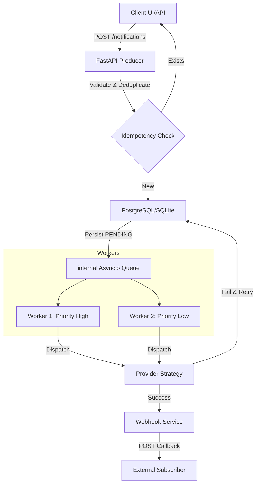

# Notipy | System Design Document

**Notipy** is a high-throughput, asynchronous notification orchestration engine. This document outlines the architectural decisions, data models, and scaling strategies that make the system production-ready.

---

## 1. High-Level Architecture

The system follows a **Producer-Consumer** pattern with an internal, non-blocking task queue.

### Core Components:
1.  **FastAPI Producer**: Handles auth, validation, and database persistence.
2.  **Internal Queue**: A thread-safe `asyncio.PriorityQueue` ensures that "Critical" notifications are processed before "Low" ones even during peak loads.
3.  **Provider Strategy**: An abstraction layer that sanitizes channel-specific logic (Email/SMS/Push) without coupling it to the core engine.
4.  **Webhook Dispatcher**: Fires events asynchronously to registered third-party listeners when delivery states change.

---

## 2. Database Schema

The system uses **PostgreSQL (AsyncPG)** for persistence.

### `notifications` Table
| Column | Type | Explanation |
| :--- | :--- | :--- |
| `id` | Integer (PK) | Unique internal ID. |
| `user_id` | String | Identity node identifier. Indexing enabled for rapid history lookups. |
| `channel` | Enum | `email`, `sms`, or `push`. |
| `priority` | Enum | Determines position in the processing queue. |
| `message_body` | Text | Rendered content after Jinja2 substitution. |
| `status` | Enum | `pending` -> `sent` OR `failed`. |
| `idempotency_key`| String | Prevents double-firing for identical incoming requests. |
| `retry_count` | Integer | Tracks recovery attempts for transient provider failures. |

### `notification_templates` Table
Enables decoupled message management. Changes here reflect globally without application redeployment. Includes `name`, `subject`, and `body` (Jinja2 format).

---

## 3. Failure & Retry Handling

Notipy assumes that downstream providers (Twilio/SendGrid) will occasionally fail.

1.  **Exponential Backoff**: When a provider returns a 5xx or network error, the worker increments `retry_count`.
2.  **State Persistence**: Before any retry, the state is persisted to the DB. If the server crashes, the `on_startup` routine sweeps the database for `PENDING` items and re-enqueues them.
3.  **Dead Letter Logic**: After 3 (configurable) failed attempts, the status is marked as `FAILED`, and a Webhook event is fired with the error payload.

---

## 4. Scaling the System

### Scaling the Workers
While currently using an internal `asyncio.Queue`, the architecture is designed to transition to **Redis/RabbitMQ** via Celery or LiteStar for horizontal scaling. Multiple container instances can then pull from the same central broker.

### Database Partitioning
As notification volume grows into millions of rows, the `notifications` table would be **partitioned by `created_at`** (monthly partitions) to maintain index performance for recent telemetry lookups.

### Rate Limiting
The system implements **Sliding Window Rate Limiting** via a local memory store. In a distributed environment, this would move to **Redis (Fixed Window or Token Bucket)** to ensure global rate limits are respected across all API nodes.

---

## 5. Trade-offs & Rationale

### Internal Queue vs. Redis
*   **Trade-off**: Used an internal `asyncio.Queue` instead of Redis for the MVP.
*   **Reason**: Lower operational complexity and zero external dependencies for local setup. The logic is encapsulated enough that swapping the producer/consumer logic for a Celery broker is a 1-day task.

### Lazy User Model
*   **Trade-off**: Notipy does not enforce a rigid "User Registry" (i.e., users can exist just as IDs).
*   **Reason**: Maximum flexibility for integration. You don't have to sync your entire user database to Notipy before you start sending notifications. Preferences are handles via "Upsert on Edit" logic.

### DateTime Timezones
*   **Trade-off**: Standardized all timestamps to `TIMESTAMPTZ` (UTC).
*   **Reason**: Resolves common data conflicts when deploying across different cloud regions (e.g., AWS us-east-1 vs India) while maintaining a consistent audit trail.
